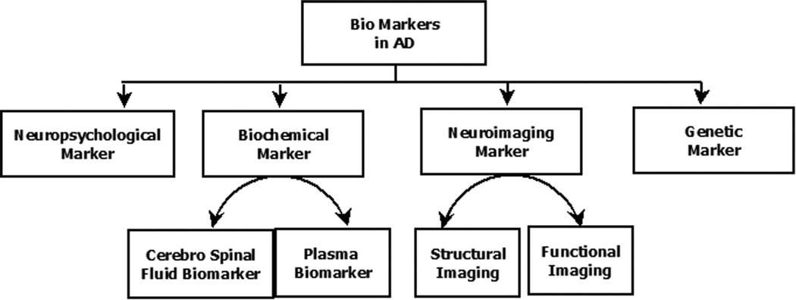

# Diss title: Transfer Learning for Alzheimer’s Disease Detection: Adapting Video Classification Models for MRI Scans

# Dissertation overview

Used pre trained video classification models to detect alzheimers in t1w mri scans

# Reason for doing so

"Most of the MRI studies demonstrated that atrophy of the medial temporal lobe structures (hippocampus, and entorhinal cortex) is common in AD. Structural MRI analysis has demonstrated that medial temporal atrophy is associated with increased risk of developing AD and can predict future memory decline in healthy adults."

- https://pmc.ncbi.nlm.nih.gov/articles/PMC4243931/#S5

"Longitudinal structural and functional imaging studies seem currently most robust to evaluate progressive impairment in MCI and AD. However, from the perspective of developing countries of the many technologies available, CT head scan and structural MRI imaging are the most useful, widely available and affordable imaging modalities."

- https://pmc.ncbi.nlm.nih.gov/articles/PMC4243931/#S20

# Biomarkers for Alzheimer's Disease

## Key Biomarkers

- **Amyloid beta and tau proteins**

  - Build up in the brain in Alzheimer's disease
  - Detectable in cerebrospinal fluid (CSF) or blood

- **Hippocampal atrophy**

  - Measured by MRI
  - Predicts conversion from mild cognitive impairment (MCI) to Alzheimer's disease

- **MicroRNAs (miRNAs)**

  - Short RNAs circulating in blood
  - Levels detectable via RNA sequencing or microarray analysis

- **Insulin pathway proteins**

  - Includes phospho-Ser312-insulin receptor substrate-1 (IRS-1)
  - Also includes phospho-panTyr-IRS-1

- **Lysosomal proteins**

  - Cathepsin D
  - Lysosome-associated membrane protein
  - Ubiquitinated proteins
  - Help discriminate Alzheimer's dementia

- **Repressor element 1-silencing transcription factor (REST)**
  - Significantly lower levels in Alzheimer's patients and MCI compared to controls

## Selected Marker: Hippocampal Atrophy

- **Primary choice for structural MRI analysis**
- **Justification:**
  - Well-established marker for AD progression
  - Directly visible on structural MRI scans
  - Medial temporal atrophy associated with increased AD risk
  - Predictive of future memory decline in healthy adults
  - Widely used in clinical settings

## T1-weighted (T1w) MRI Justification

- Provides optimal white/gray matter contrast
- Enables clear visualization of hippocampal structures
- Allows precise measurement of atrophy progression
- Standard sequence in neuroimaging protocols
- Most effective for detecting structural changes in brain tissue
- Widely available in clinical settings

# Models

## 3D ResNet Models

- **Rationale for selection:**

  - ResNet architectures have proven highly effective for 2D image classification tasks, particularly ResNet50 which has become a standard benchmark in medical imaging
  - 3D adaptations preserve the key benefits of residual connections while handling volumetric data crucial for MRI analysis
  - Prior research demonstrates 3D ResNets can effectively capture spatial relationships across MRI slices that would be lost in 2D analysis
  - Provides a robust baseline with established performance metrics for comparison

- **Specific advantages for MRI analysis:**
  - Capable of learning hierarchical features from volumetric brain scans
  - Residual connections mitigate vanishing gradient problems in deep networks, especially important for subtle hippocampal deterioration patterns
  - Computationally efficient compared to other 3D architectures
  - Pretrained weights available from video classification tasks that can be fine-tuned

## 3D Vision Transformer (ViT) Models

- **Rationale for selection:**

  - Transformers have demonstrated state-of-the-art performance in multiple vision tasks through their attention mechanisms
  - 3D ViT architectures can process entire MRI volumes as sequences of patches, maintaining global context
  - Recent studies show ViTs outperforming CNNs in various medical imaging classification tasks
  - Self-attention mechanisms potentially more effective at identifying subtle structural changes across brain regions

- **Specific advantages for MRI analysis:**
  - Attention mechanisms can focus on the most relevant regions (like hippocampus) without explicit region segmentation
  - Better at modeling long-range dependencies between distant brain regions
  - Less reliant on hand-crafted architectural inductive biases
  - Potential for transfer learning from large-scale pretraining on video datasets

# Datasets

## Oasis (Open Access Series of Imaging Studies)

**Key features:**

- Open-access dataset specifically designed for neuroimaging research
- Contains cross-sectional and longitudinal MRI data of cognitively normal adults and individuals with Alzheimer's disease
- Includes demographic, clinical, and cognitive assessment data alongside imaging
- Well-structured with standardized preprocessing protocols

**Justification:**

- Provides high-quality T1w MRI data with clinical validation
- Contains sufficient demographic diversity for model generalization
- Longitudinal data allows tracking of disease progression
- Open access removes barriers to research reproducibility
- Widely cited in neuroimaging literature, enabling comparison with prior studies

## ADNI (Alzheimer's Disease Neuroimaging Initiative)

**Key features:**

- Comprehensive multimodal dataset (MRI, PET, biospecimens, cognitive assessments)
- Follows subjects across the Alzheimer's spectrum (normal, MCI, AD)
- Rigorously standardized acquisition protocols across multiple sites
- Regular updates with new data and refined diagnostic criteria

**Justification:**

- Gold standard dataset for Alzheimer's research with expert-validated diagnoses
- Multi-site data collection improves model robustness to scanner variability
- Longitudinal design captures disease progression at various stages
- Contains detailed clinical metadata for potential subgroup analysis
- Large sample size provides sufficient data for deep learning approaches
- Allows for correlation between imaging findings and other biomarkers

# Framework

## PyTorch with Weights & Biases (wandb)

**PyTorch justification:**

- Industry-standard deep learning framework with extensive community support
- Native support for 3D convolution and transformer architectures
- Dynamic computational graph allows flexible experimentation with network architectures
- Efficient MPS utilization for processing large volumetric MRI data
- Rich ecosystem of medical imaging libraries (MONAI, TorchIO) built on PyTorch
- Simplified transfer learning from pretrained video models

**Weights & Biases (wandb) justification:**

- Comprehensive experiment tracking for hyperparameter optimization
- Visualization tools for model performance metrics across training runs
- Artifact versioning for dataset and model management
- Collaborative features for sharing results and insights
- Integration with PyTorch for minimal implementation overhead
- Automated logging reduces manual documentation burden
- Enables reproducibility through experiment configuration tracking

**Implementation strategy:**

- Use PyTorch's DataLoader with custom augmentations for 3D MRI volumes
- Leverage MONAI for medical imaging-specific preprocessing and validation
- Implement transfer learning from video classification pretrained weights
- Track experiments with wandb for systematic comparison between ResNet and ViT approaches
- Monitor classification metrics to assess model interpretability

# The Process

## Data Acquisition

Applied for access to ADNI and Oasis explaining my diss, granted very quickly.

Only pulled from adni as it had more than enough

used adni 1 first and expanded to adni 2,3, and 4

just t1w MpRAGE scans

the actual split is about 33/66 AD/CN so I selected all the AD scans and then took as many subjects as possible using round robin from CN to get to 50/50

only focused on AD and CN as MCI is harder to diagnose from atrophy, in fact, atrophy is a good measure of AD and advanced AD at that.

## preprocessing

- convert from dicom to nii so its an actual 3d file
- split into AD and CN patients
- skull stripping
  - didnt just want to use BET and its a naive method and doesn't always pull an accurate brain even though its quick
  - BET can fail on the kind of scans it hasn't seen before so opted for a deep learning method instead
  - state of the art was synth strip, on my puny m1 it takes 2m a scan but worth it for the perfect results
- didn't use spatial normalisation as resnet will learn these variations on its own
- vocel standardisation to 1x1x1
- crop and reshape
  - I did my first training run having interpolated down to 96x96x96. I realize that I might have lost detail during interpolation. Then I realized that during preprocessing I was so focused on creating data that was clear and normal but I hadn't considered efficiency of data size. I realized that the scans I was interpolating had loads of empty space around them and after interpolating down there was barely any info left for the brain. So instead I cropped all of my images leavin 3 voxel gap on each side so they were more efficient with space and only interpolated to 128x128x128 giving me far more information. This performed much better.
- bias field correction
- standardise orientation

## splitting the data

originally i was getting very good accuracies of above 90% but realised I had group leakage. none of the same scans were shared across train val and test, the subjects were, once I completely separated the subjects I got more in the region of 70% accuracy which seems more realistic. it uses a round robin in order to split the number of subjects as evenly as possbile over train val and test such that there is a diverse enough range for testing.

started off using very few scans
train: 678
val: 86
test: 86

However as you can see below, these 849 scans are coming from only 211 subjects, this isn't a particularly diverse set.

Total subjects in train/val: 201
Total subjects in test: 10
Total subjects in dataset: 211

so after pulling more data got it to this:

Condition: AD
Target scan counts -> Train: 520, Val: 65, Test: 65
Actual split scan counts:
train: 512 scans over 133 subjects
val: 69 scans over 35 subjects
test: 69 scans over 35 subjects

Condition: CN
Target scan counts -> Train: 520, Val: 65, Test: 65
Actual split scan counts:
train: 511 scans over 115 subjects
val: 70 scans over 45 subjects
test: 69 scans over 45 subjects

Copied 1300 files into split directories.

Final subject counts per condition:
Condition AD:
train: 133 subjects
val: 35 subjects
test: 35 subjects
Condition CN:
train: 115 subjects
val: 45 subjects
test: 45 subjects

## models

used an 18 layer resnet 3d model trained on kinetics400 v1. unfrozen finally fully connected layer and final block so most of the parameters were unfrozen but that's alright. early layers were frozen still.

I tied with only the fc layer unfrozen which gives me these stats:

Total parameters: 33,148,482
Trainable parameters: 1,026 (0.00%)
Frozen parameters: 33,147,456 (100.00%)

I ran that model with only fc unfrozen for hours until I came back and realized that the losses were spitting out nans while training. I tested and if you add the 4th layer back in it works fine, I have no idea what's going on. With the fourth layer unfrozen it looks like this. I did get great results this way.

Total parameters: 33,148,482
Trainable parameters: 24,909,826 (75.15%)
Frozen parameters: 8,238,656 (24.85%)

I've tried changing the learning rate and adding gradient clipping but neither stopped the nans

- MVIT:
  - I tested the movie vision transformers, it did not want to work for a while, and finally I got it to work but then it won't run unless you have 32gb of ram, which I don't. I'm just gunna make a note of this, and say how it's more intensive. Also, it's made to work on an input of 16x224x224 but mine is 128x128x128, I think there would be significant loss when adapting to that, I considered just taking the 16 middle slices but that's losing a lot of important data and you might as well got to 2d. No biggie, one less thing to analyze. I can mention what happened as a side note in the methodology.
  - but It looks like we're running into a memory issue with the MViT model when processing our 128×128×128 MRI volumes. The error "Invalid buffer size: 32.00 GB" indicates that the attention mechanism is trying to allocate a very large buffer, which exceeds available memory.
  - The attention mechanism in MViT isn't optimized for such large 3D inputs (128×128×128), made for 16x224x224.
  - It would also expect to need lots more data and we only want to use a little

I ran using a different architecture, I didn't think it would provide better performance and I wanted to see if I was right. I had originally been using a 18 layer Resnet3D architecture and this time I used a similar but slightly different 18 layer Mixed Convolution network, it used a combination of 2d and 3d CNN layers. It didn't work as well, and seemed far less stable in training, but it's useful to justify my 3d method.

Part of the point is to compare to using a 2d model only and as we can see hear the more 2d we got the worse results.

Before training i had the scans in my train set undergo augmentations to improve genralisations, tunrs out rotations and flips didn't really do anythin to help at all, neither do scale difference, and only slowed the process, whereas noise, gamma, and normalisation helped generlisation. keep in mind I normalised not only the train set but all the scans. I noticed that even when getting 95% accuracies because i had group leakage, the reason it was taking 20 epochs to get there was because of the flips and rtations and unneccessary augmentions, as I kept testing i realised that the less I flipped and messed with things which weren't actually different in the test set the more it did nothing but slow the training and get slightly worse accuracies. If anything I'm completely sure wether adding noise and gamma are a good idea, i know normalisation is good but not the other two, especially seen as I have bias field correction anyway. I started off with rather large monai augs, moved to torchio augs that were subtler and saw much quicker training due to using less flips and rotate, realised the less I messed with augs the better results I got. I ended up using random noise, random gamme, and z norm in that order.

## Results and Analysis

Quantitative Metrics: Accuracy, precision, recall, F1-score, AUC-ROC
Confusion Matrices: Breakdown of classification
After lots of training my final models are currently getting about 77% accuracy, I want to compare this to how accurate radiologist/doctor is when diagnosing just off of an MRI scan. After 3-fold cross validation I'm getting a mean of 77.26% and a satndard deiation of 2.34. If I can beat a doctor I'm happpy I want this to be one part of the decision tree that helps diagnosis becuase it may well be the case that not all AD scans can be classified easily because atrophy is something we see in advanced AD.
Also want a bayesian analysis test so not just on 50/50 but on the kind of group that this qould be used on in practice.
Also want to try XAI so I can relate it with hippocampal atrophy or not. Suggest how It would be intersting to see this done with multiclass setup I would expect it's more accurate the more advance the AD.

# Challenges and limitation

- technical challenges were hard, not able to access beefy computer so had to run without gpu on M1 Mac leading to runs taking upwards of 20 hours
- each epoch took an hour
- optimisation issues:

  - tried mixed precision, nothing
  - layer optimisation, nothing
  - optimal batch size, nothing, they just scaled
  - I found that it was a synchronisation issue, eliminated CPU-GPU synchronization bottlenecks in the training loop, shifting time from wasteful waiting to actual model computation, but once fixed turns out it was all in the forward pass anyway and so the timing was just off and all I saved was a fraction compared to the whole time, and no matter what I did, it remained

- If had beefy pc wouldve pulled more data, not gone 128x128x128 and stayed as high as possible, and couldve tested on larger architecures like mvit
- only used MPRAGE scans could include acclerated and other kinds of t1w weighted scan

# what do I need to do to finish

- [x] mvit
  - that shit don' work unless you got 32gb of ram and even then it'smade for 16x224x224 which is very different
- [x] 3-fold cross validation, if crazy diff the split understand using xml
  - done now, got mean 77.26 mean and 2.34 sigma
- [ ] xai
  - [ ] what its recognizing
  - [ ] Give an idea of how the classification works
  - [ ] In video its timeframe but in my case in depth
  - [ ] Link relevant neurons with a specific depth of mri resolution or a feature of it
  - [ ] activation maps to visualise or gradCAM
- [ ] look at similar paper and use it to compare
- [ ] final eval
  - [ ] Make the comparison to the primitive 2d
  - [ ] Compare this to the state of art, can I claim that I’ve got the best?
  - [ ] Use a representative test of people who get this scans
  - [ ] bayesian analysis
  - [ ] Comprehensive final validation evaluation metrics
